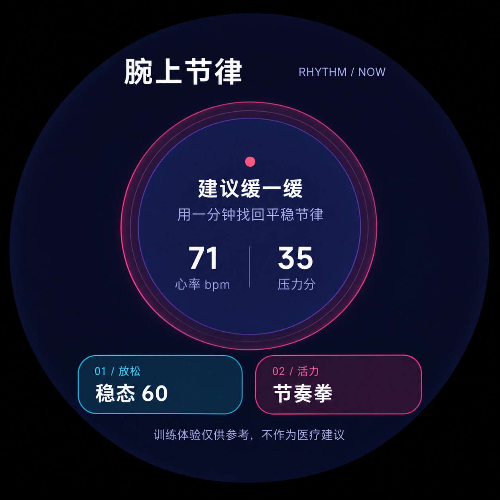
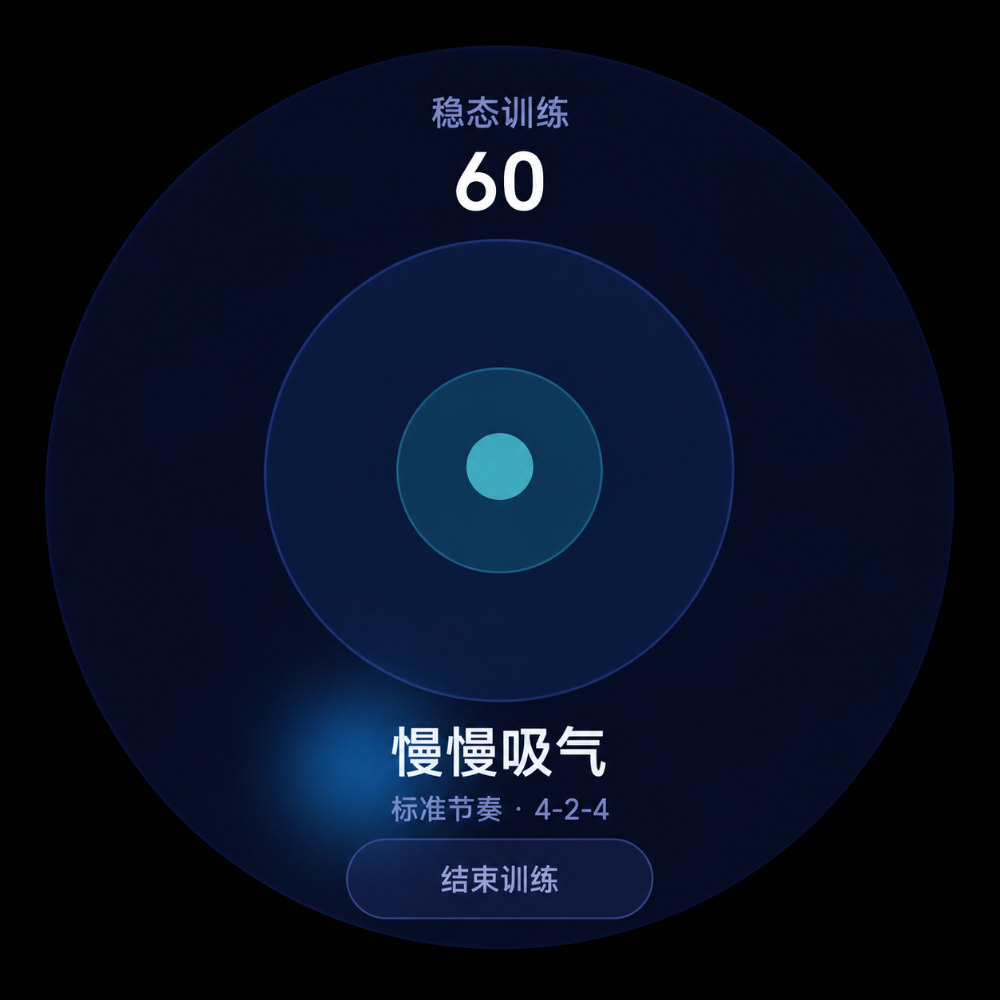
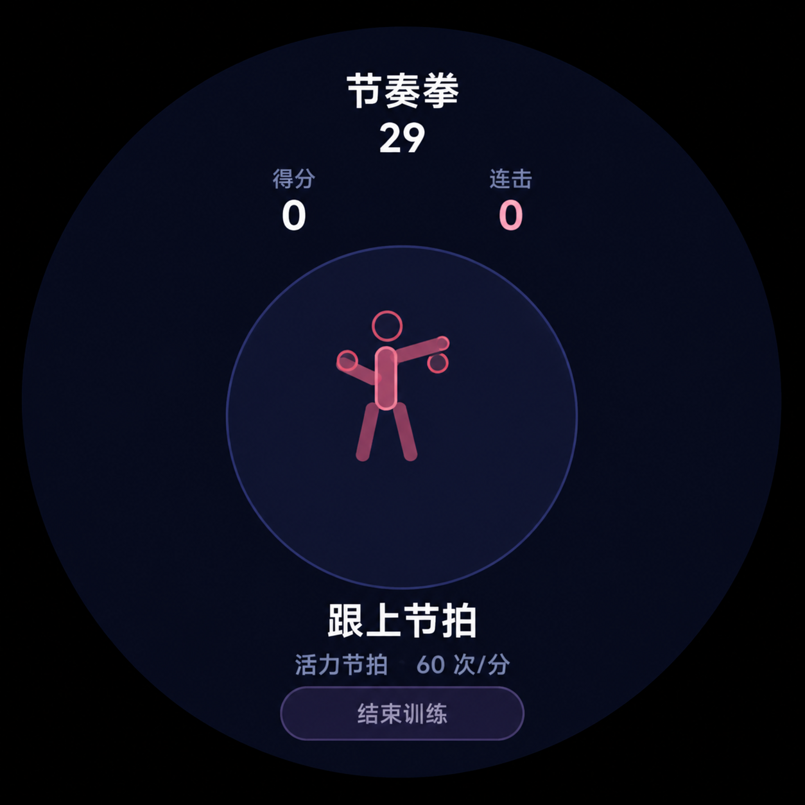
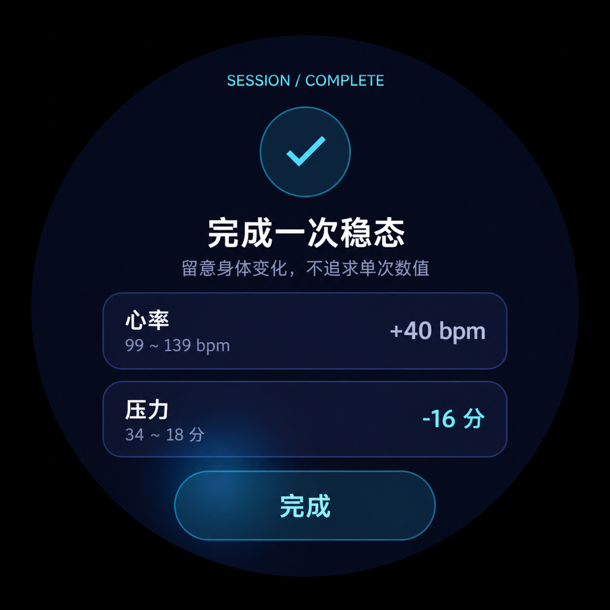

# 腕上节律（Wrist Rhythm）

> 将健康数据转化为可立即参与的腕上呼吸训练与节拍运动。

## 界面展示

| 健康首页 | 稳态呼吸训练 |
| --- | --- |
|  |  |

| 节奏拳训练 | 稳态训练结果 |
| --- | --- |
|  |  |

以上图片来自 AIoT 模拟器验收画面，并裁切为纯应用界面。

## 一、作品简介

腕上节律是一款面向 openvela 圆形手表的身心训练快应用，包含两种一分钟内即可完成的体验：

- **稳态 60**：读取心率、压力及变化趋势，提供 60 秒 4-2-4 或 4-2-6 呼吸训练，并在结束时展示训练前后变化。
- **节奏拳**：通过加速度计识别腕部动作，完成 30 秒节拍挑战；心率升高时自动降低节拍速度。

应用围绕 480×480 圆形表盘和短视口设计。健康数据或加速度计不可用时，会分别降级为离线呼吸训练和点击模拟模式，不因单项系统能力缺失而阻断核心体验。

## 二、选题方向

**快应用 / 手表应用创新**。

作品利用 openvela 快应用的健康服务、传感器和生命周期能力，把手表上的被动指标展示扩展为“状态提示—主动训练—结果反馈”的完整闭环。

## 三、核心亮点

- 实时读取和订阅心率、压力，结合高值与上升趋势给出训练建议。
- 仅在完整呼吸周期边界调整节奏，避免训练过程发生突兀跳变。
- 使用真实经过时间驱动倒计时，切入后台时暂停会话并释放健康订阅、传感器和计时器，返回前台后安全恢复。
- 加速度突变识别、350 ms 动作防抖、三级节拍评分、连击统计与心率自适应节奏。
- 对健康接口、订阅、加速度计和设备信息失败提供明确的异常处理与降级路径。
- 使用青蓝静息能量与玫红运动能量组成棱镜夜光界面，并针对圆屏安全区、紧凑尺寸和短视口适配。
- 67 项自动化测试覆盖训练算法、系统适配、页面生命周期、组件契约和发布构建编排。

## 四、目录结构

```text
quickapp/wrist-rhythm/
├── src/
│   ├── manifest.json             # 手表设备、权限、系统能力和路由
│   ├── common/                   # 应用图标
│   └── pages/index/              # 页面编排、训练逻辑、系统适配和展示组件
├── test/                         # 逻辑、生命周期、组件契约和发布测试
├── scripts/                      # 发布构建与图标优化工具
├── docs/                         # 设计记录、实施计划和界面图片
├── package.json                  # 依赖与构建命令
└── README.md                     # 详细功能、接口及模拟器验收说明
artifacts/                        # 可供评审安装的调试签名 RPK
logs/                             # AI Coding 日志与格式说明
contest2026_467_chibubaoduibudui.xml
                                  # repo manifest 与快应用映射
```

manifest 将作品映射到 openvela 工作树中的：

```text
packages/apps/contest2026_467_wrist_rhythm
```

## 五、运行方式

### 1. 拉取完整工程

```bash
repo init -u https://github.com/open-vela/contest2026_467_chibubaoduibudui \
  -b dev-ai-contest-2026 -m contest2026_467_chibubaoduibudui.xml
repo sync -c -j8
```

同步后，参赛仓库位于 `contest2026_467_chibubaoduibudui/`，其余 openvela 源码位于同一工作区外层。

### 2. 准备快应用环境

需要：

- Node.js 22 或更高版本
- AIoT IDE
- `aiot-core` 与 `aiot-emulator` 1.7.22 或更高版本
- 模拟器镜像 `vela-miwear-watch-5.0(开发者大赛)`

```bash
cd contest2026_467_chibubaoduibudui/quickapp/wrist-rhythm
npm ci
npm test
npm run build
```

调试包生成于：

```text
dist/com.openvela.wristrhythm.debug.1.0.0.rpk
```

### 3. 在模拟器运行

1. 使用 AIoT IDE 打开 `quickapp/wrist-rhythm/`。
2. 新建并启动 `vela-miwear-watch-5.0(开发者大赛)` 模拟器。
3. 选择该设备，编译并推送应用。
4. 按[详细模拟器验收步骤](quickapp/wrist-rhythm/README.md#模拟器验收)检查健康数据、呼吸训练、节奏拳、结果页、后台恢复和降级模式。

### 4. 发布构建

```bash
npm run build:release
```

发布构建启用 JSC、CSS 属性优化、PNG8 和移除 console。正式发布包需要发布方管理的签名证书；仓库不包含私钥或分发凭据。`artifacts/com.openvela.wristrhythm.debug.1.0.0.rpk` 使用工具链演示签名，仅供评审和模拟器验证。

## 六、AI Coding 使用说明

本作品在需求拆解、方案设计、编码、调试、测试和文档环节持续使用 AI Coding：

- 将健康订阅、训练时钟、动作识别和页面生命周期拆为职责单一、可独立验证的模块。
- 先用测试固定倒计时边界、异步回调代际、资源释放、异常降级和组件装配行为，再实现或调整代码。
- 通过设计文档与实施计划记录圆屏安全区、视觉系统、动画兼容性和运行时决策。
- 结合 AIoT 模拟器截图检查首页、训练页和结果页，迭代圆屏布局与动效。
- 为发布脚本加入可注入工具链测试，避免把旧 RPK 误认为本次构建产物。

设计和实施记录位于 `quickapp/wrist-rhythm/docs/superpowers/`，完整 AI Coding 对话日志位于 [`logs/inskr/`](logs/inskr/)。

## 七、验证结果

```bash
npm test
```

当前共 67 项测试，覆盖：

- 稳态判定、呼吸阶段、训练结果、动作识别、评分与布局选择
- 可暂停时钟、健康订阅状态、响应式写入与页面生命周期
- 组件 props、事件、圆屏适配、动画兼容性和视觉作用域
- 发布暂存、正式 RPK 识别、旧产物清理与工具链错误检测

## 八、兼容性与免责声明

加速度计使用官方 `@system.sensor.subscribeAccelerometer({ interval: 'game' })`。不支持该能力的设备会明确进入点击模拟模式，稳态呼吸训练不受影响。

本应用只提供放松和运动训练体验，不用于疾病诊断或治疗，也不以单次健康读数替代专业医疗判断。

更多实现细节见 [应用详细说明](quickapp/wrist-rhythm/README.md)。
